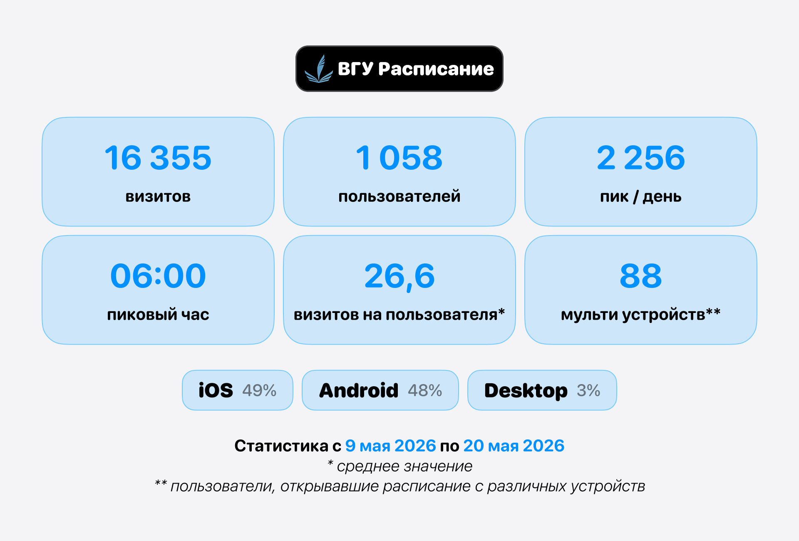

Мобильное веб приложение для просмотра расписания Витебского государственного университета имени П.М. Машерова

## История
Данное приложение было запущено **1 февраля 2026** года под названием "**ВГУ Расписание**" в мессенджере Telegram. За время использования данного приложения вышло более **100 релизов**, многие из которых пользовались популярностью у большинства студентов ВГУ. 

После успешного запуска 1ой и 2ой версии было принято решение разработать новое _веб приложение_, доступное каждому студенту без использования сторонних платформ. Именем для данного проекта стало "**VSU Box**". **VSU Box** - это кроссплатформенное решение, основанное на базе pwa технологий. Данные, которые использует приложение копируются с [официального сайта университета](https://vsu.by "Сайт Витебского государственного университета имени П.М. Машерова"). Данные пользователей хранятся в защищеном виде на серверах разработчика приложения, доступ к ним можно получить непосредственно только с устройства целевого пользователя. 

## Как установить приложение
Подробная инструкция по установке приложения на мобильное устройстве [показана на сайте](https://vsu-box.whoennrl.ru)

## Статистика предыдущих версий

## Разработка расширений для VSU Box
В приложении **VSU Box** вы ничем не ограничены! Мы разработали SDK для разработчиков, которое позволяет писать дополнения к основному функционалу приложения.

## Дополнительные ссылки
+ [Документация SDK и API](https://vsu-box.whoennrl.ru/docs)
+ [Заявка на режим разработчика](https://t.me/tribute/app?startapp=i1k2)
+ [Поддержать автора](https://t.me/tribute/app?startapp=dJLB)
+ [Сайт Витебского государственного университета имени П.М. Машерова](https://vsu.by)

